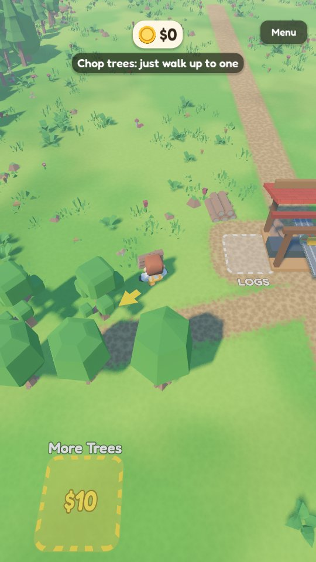
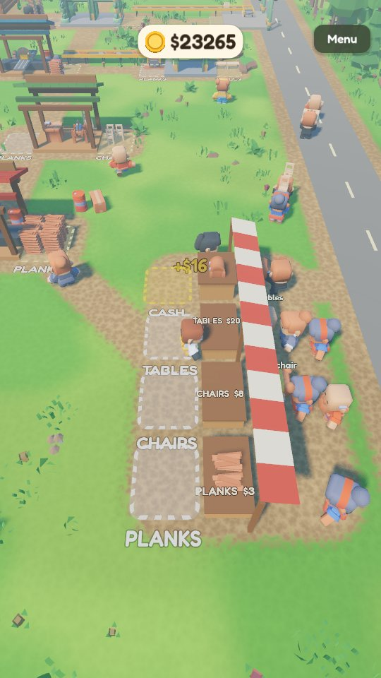
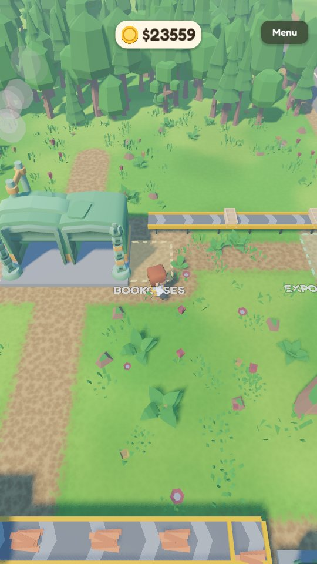

# Timber Valley

A calm lumber mill game for Android. You chop trees, saw logs into planks,
sell them at a market by the road, and spend the money on new machines,
workers and factories. **No ads, no in-app purchases, no timers, no analytics.**

It is a clean version of the "idle arcade" mini-games you see in mobile ads
(Pizza Ready, Idle Lumber and similar): the part of the ad that looks fun,
without the ad-supported game wrapped around it.

  
  
  

## Download

**Direct APK download:**
https://github.com/Matswm86/timber-valley/releases/download/latest/timber-valley.apk

1. Open that link in your phone's browser and tap to download.
2. When you open the file, Android may ask you to allow installs from this
   source. Tap **Settings**, turn on **Allow from this source**, go back and
   install.
3. The app appears as **Timber Valley**.

The APK is debug-signed with a stable key, so a newer build installs over an
older one and keeps your save.

## How to play

Drag anywhere on the screen to walk. Everything else happens by standing on
things:

| Stand on or next to | What happens |
|---|---|
| A tree | You chop it; the logs stack up in your arms |
| A white square marked LOGS | You drop logs into the machine |
| A square marked PLANKS, CHAIRS... | You pick up what the machine made |
| A market counter | You stock it; shoppers walk in from the road and buy |
| CASH | You collect what the shoppers paid |
| A yellow square with a price | You pay for the next building or worker |
| UPGRADES | The upgrade shop opens |

A yellow arrow at your feet points to the next useful thing, so you never have
to wonder what to do. Progress saves by itself.

## What you can build

19 purchases, from $10 to $5,000, unlocked a few at a time:

- **Forests**: more broadleaf trees, a pine forest, a north forest.
- **Machines**: two sawmills (log to planks), a carpentry (planks to chairs),
  a CNC workshop (planks to tables), a robot furniture factory (logs to
  bookcases).
- **Workers**: lumberjacks who chop and deliver logs, carriers who move goods
  between machines and the market, and a cashier who collects the money.
- **Automation**: conveyor belts that feed machines on their own, and a truck
  dock where a truck loads bookcases and pays on the way out.
- **Upgrades**: bigger backpack, faster shoes, sharper axe, faster machines,
  faster workers, better prices.
- **The Grand Lodge**: the last purchase. The game says congratulations, and
  your workers keep going if you want to stay.

## Graphics and sound

Real-time 3D with Godot's Mobile (Vulkan) renderer: soft sun shadows, drifting
cloud shadows, a flowing river, shingle roofs, glow, sawdust and wood-chip
particles. Characters are animated, and a carried stack sways as you walk.
The music loop and forest ambience come from `tools/make_music.py`
(numpy + scipy, no samples); sound effects are Kenney CC0 packs.

## Credits

- 3D models and sound effects: [Kenney](https://kenney.nl) (CC0): Nature Kit,
  Survival Kit, Mini Characters, Factory Kit, Furniture Kit, Car Kit, Impact
  Sounds, Interface Sounds, RPG Audio, Casino Audio. Some textures were
  recoloured.
- Font: [Fredoka](https://github.com/google/fonts/tree/main/ofl/fredoka)
  (SIL Open Font License, see `assets/fonts/OFL.txt`).

## Run from source

1. Install **Godot 4.6.x** from https://godotengine.org/.
2. Import `project.godot` and press **F5**. On desktop, WASD or the arrow keys
   walk, and the mouse works as a touch.

`tests/capture.tscn` is a dev-only scene (not exported) that plays the
tutorial with a bot, unlocks everything and saves screenshots. Run it under
Xvfb with `CAPTURE_DIR=/some/dir`; add `CAPTURE_MODE=shots` to skip the bot.

## Build

GitHub Actions builds the APK on every push to `main`
(`.github/workflows/build-android.yml`) and publishes it to the rolling
`latest` release. Pushing a `vX.Y.Z` tag creates a versioned release.
